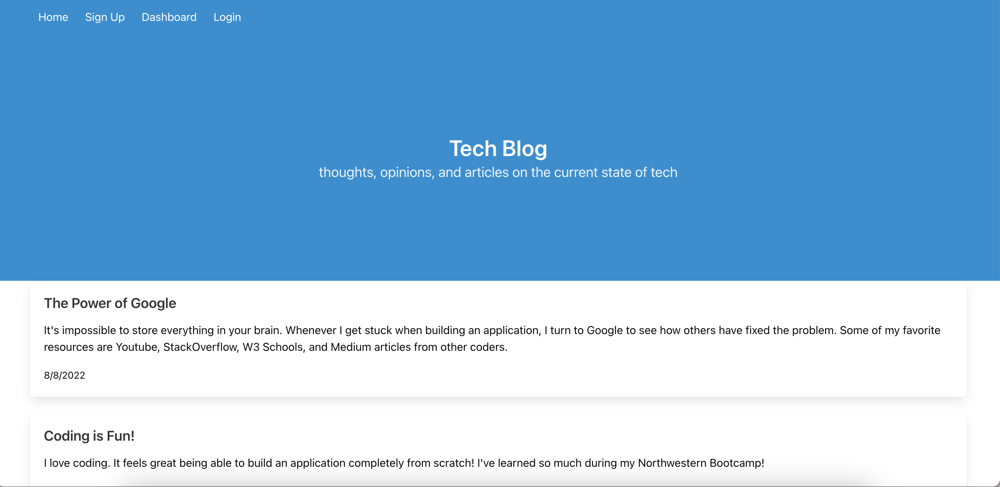

# Tech Blog

## Description
This application is a CMS-style blog site that allows users to write posts about tech and engage with other user's posts by adding comments to them. In addition to creating new posts and comments, users are also able to edit and delete their posts and comments. 

In order to fully engage with the application by posting and commenting, users must create an account. However, users may view all posts and comments on the blog without being logged in. 

This application was built using MVC framework, with Handlebars.js as the templating engine. It also uses Sequelize as the ORM and the express-session npm package for session authentication.

## Table of Contents
- [Installation](#installation) 

- [Link to Deployed Application](#link-to-deployed-application)

- [Features](#features)

- [Screenshots](#screenshots)

- [Demo](#demo)

- [Questions](#questions)

- [License](#License)

## Link to Deployed Application
This application is deployed via [Heroku](https://maiavelli-tech-blog.herokuapp.com/).

## Features
- CSS Framework: Bulma
- Database: MySQL 
- Middleware: Express.js
- Object Relational Mapping: Sequelize
- Password Encryption: bcrypt 
- Session Authentication: express-session npm package
- Template Engine: Handlebars.js

## Screenshots

## Demo 
Below is a short demo of the application's functionality: 

## Questions 
For more information and to see more of my work, please visit my [GitHub](https://github.com/maiavelli/).

For any additional questions or general inquiries, you can contact me at [maiacamilledavis@gmail.com](mailto:maiacamilledavis@gmail.com).

## License
Copyright (c) `2022`, `Maia Davis`

Permission to use, copy, modify, and/or distribute this software for any purpose with or without fee is hereby granted, provided that the above copyright notice and this permission notice appear in all copies.

THE SOFTWARE IS PROVIDED "AS IS" AND THE AUTHOR DISCLAIMS ALL WARRANTIES WITH REGARD TO THIS SOFTWARE INCLUDING ALL IMPLIED WARRANTIES OF MERCHANTABILITY AND FITNESS. IN NO EVENT SHALL THE AUTHOR BE LIABLE FOR ANY SPECIAL, DIRECT, INDIRECT, OR CONSEQUENTIAL DAMAGES OR ANY DAMAGES WHATSOEVER RESULTING FROM LOSS OF USE, DATA OR PROFITS, WHETHER IN AN ACTION OF CONTRACT, NEGLIGENCE OR OTHER TORTIOUS ACTION, ARISING OUT OF OR IN CONNECTION WITH THE USE OR PERFORMANCE OF THIS SOFTWARE.

